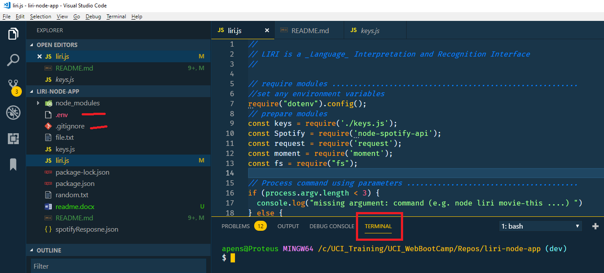

# LIRI Bot Project

_by Armando Pensado_

**LIRI Bot** is a _language_ interpretation and recognition interface.

## Description

**LIRI Bot** is an application made with NodeJS, and even though is not a server, it offers basic infrastructure to act upon user commands. The program will receive a command and a search-topic as parameters, and base on these, it will retrieve data using particular API and present the results in the Terminal and a log file. The application will retrieve data related with concerts, music, or videos.

## Video Presentations

Introduction videos are available at Google Drive, in teh following location:

[Liri Bot Project videos] ( )


## How does it work

The application is capable to receive the following commands:

**node liri.js concert-this '<artist/band name here>'**  : This command will search for concerts for a given music artist or band. It will return concert schedules, if available. The information is retrieved from [Bands In Town API](http://www.artists.bandsintown.com/bandsintown-api). The user must provide a search topic.

**node liri.js spotify-this-song '<song name here>'** : This command will search form music information for a given music song. It will return from [Node-Spotify-API](https://www.npmjs.com/package/node-spotify-api) the matches for the song. If the song name is not provided, the command will search as default the topic 'The Sign'.

**node liri.js movie-this '<movie name here>'** : This command will search for movie titles for a given movie name. It will return possible movies from [OMDB API](http://www.omdbapi.com), if available. If the movie name is not provided, the application will use as default 'Mr. Nobody'.

**node liri.js do-what-it-says** : This command will look for the file "**random.txt**", and will read its contents. It is expecting to find a single line with two elements delimited by a comma: a) a command, and b) a search topic. The expected command is one of the commands previously mentioned. The command cannot be “_do-what-it-says_”. An example for the contents in the file is as follows. 

```js
_random.txt_  :  spotify-this-song,"I Want it That Way"
```

## Who can benefit from this application

This application is beneficial for NodeJS developer, providing a example about programming structures using JavaScript, external API, external modules like ‘**request**’, ’**moment**’, and ‘**fs**’ (File System). It also offer an example from hiding user keys for the APIs, using a ‘**.env**’ file. 

## How developers can get started

To start, the developer must have NodeJS installed in the computer. After, that the project can be cloned (or forked) and initialized with the NodeJS external modules.  The developer must get her/his on keys form Spotify and set them inside the a file “**.env**”, these will work in conjunction with the “**keys.js**” file. Here is the steps for getting started:

1. Install NodeJS into the computer  (https://nodejs.org/en/). Download button and run through the installation file.

2. Fork the project or clone it into the computer.

3. In the folder project, Make a `.gitignore` file and add the following lines to it. This will tell git not to track these files, and thus they won't be committed to Github.

```js
node_modules
.DS_Store
.env
```

4. Create a file named `**.env**`, add the following to it, replacing the values with your API keys (no quotes) once you have them:

```js
# Spotify API keys

SPOTIFY_ID=your-spotify-id
SPOTIFY_SECRET=your-spotify-secret
```

5. Bring all external module dependencies using the command:  node i

After, the initialization, and using Microsoft Visual Code, the project folder should resemble as depicted below, and should be ready for execution.



## How to use the application

The user can enter in the terminal any of the command indicated below, and the Terminal should reflect the data retrieved.

* node liri.js concert-this '<artist/band name here>'  
* node liri.js spotify-this-song '<song name here>'
* node liri.js movie-this '<movie name here>'
* node liri.js do-what-it-says

For example, it is depicted the command to find “**Carrie Underwood**” concerts.


Additional to the output into the terminal, the collected data will be also dumped into the “file.txt” file. The following image shows the file generated and its content.


The commands for ‘_concert-this_’, ‘_spotify-this-song_’, and ‘_movie-this_’ works for the most part in a different way, just providing different data. 

Nevertheless, the it is worth to mention in more detail the command ‘_do-what-it-says_’.

### do-what-it-says command 

The command ‘do-what-it-says’ will make the application read inside the ‘random.txt’ looking for the command and search-topic.  The file and its contents are as depicted below.


The user can change the contents of the file to invoke any other available command, for example

* concert-this, 'Carrie Underwood'
*	spotify-this-song, ''Incomplete’
*	movie-this, 'Man of Steel'

The following example, depicts the execution of the command “_node liri.js do-what-it-says_” and the the ‘**randmo.txt**’ file has “**movie-this, 'Man of Steel'**”. The result is as follows.


As any other command, the log file will reflect the result of this search.


## Who maintains and contributes to the project

This is a personal project based on UCI Bootcamp training. 

## Where users can get help with your project

The developer can refer to the following links:

*	NodeJs  : https://nodejs.org/en/
*	Node-Spotify-API:  (https://www.npmjs.com/package/node-spotify-api)
*	OMDB API : (http://www.omdbapi.com)
*	Bands In Town API : (http://www.artists.bandsintown.com/bandsintown-api)
*	Request : (https://www.npmjs.com/package/request)
*	Moment : (https://www.npmjs.com/package/moment)
*	DotEnv : (https://www.npmjs.com/package/dotenv)
